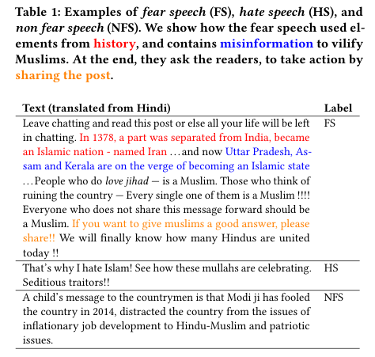

## "Short is the Road that Leads from Fear :fearful: to Hate :cursing_face: " :Fear Speech in Indian WhatsApp Groups [Accepted at The Web Conference 2021] 

:warning: ***WARNING: The repository contains content that are polarising in nature.*** :warning:

### :tada: :tada: Have a look at our preprint for more detailed information [link here](https://arxiv.org/abs/2102.03870) :tada: :tada:.

## Abstract

WhatsApp is the most popular messaging app in the world. Due to its popularity, WhatsApp has become a powerful and cheap tool for political campaigning being widely used during the 2019 Indian general election, where it was used to connect to the voters on a large scale. Along with the campaigning, there have been reports that WhatsApp has also become a breeding ground for harmful speech against various protected groups and religious minorities. Many such messages attempt to instil fear among the population about a specific (minority) community. According to research on inter-group conflict, such "fear speech" messages could have a lasting impact and might lead to real offline violence. In this paper, we perform the first large scale study on fear speech across thousands of public WhatsApp groups discussing politics in India. 

------------------------------------------
**Contributions** :volcano:	
------------------------------------------

* We curate a **new dataset** and try to characterize fear speech from this dataset. 
* We observe that users writing fear speech messages use **various events and symbols** to create the illusion of fear among the reader about a target community. 
* We build models to **classify fear speech** and observe that current **state-of-the-art NLP models do not perform well** at this task. 
* Fear speech messages tend to spread faster and could potentially go undetected by classifiers built to detect traditional toxic speech due to their **low toxic nature**. 
* Finally, using a novel privacy preserving methodology to **target users with Facebook ads**, we conduct a survey among the users of these WhatsApp groups to understand the perception of users who consume and share fear speech. 

------------------------------------------
**Example from the dataset** :writing_hand:	
------------------------------------------

**Please cite our paper in any published work that uses any of these resources.**

~~~bibtex
@article{punyajoy2021fear,
  title={"Short is the Road that Leads from Fear to Hate": Fear Speech in Indian WhatsApp Groups},
  author={Saha, Punyajoy and Mathew, Binny and Garimelaa Kiran and Mukherjee, Animesh},
  journal={arXiv preprint arXiv:2102.03870},
  year={2021}
}

~~~

------------------------------------------
**Folders' Description** :open_file_folder:	
------------------------------------------
~~~
./Data                --> Contains dataset related files.
./Network             --> Contains precomputed network files for user and emoji networks.
./models	      --> Contains deep learning model architecture codes and helper codes.
./utils               --> Contains several utility functions for common usage.
~~~
----------------------------------------------------------
**Notebooks' description** :notebook_with_decorative_cover:
----------------------------------------------------------
~~~

Classical_models.ipynb  --> Contains the implementation of doc2vec vectors with Support vector machines and Logistic Regression 
Data-statistics.ipynb   --> Contains common data statistics and comparison between fear speech and non fear speech based on their sharing, number of groups, and number of users.
Inference.ipynb         --> Contains the performance scores for test dataset across 5 fold cross validation. Also calculates the lime based interpretability for few of the samples.
Network_analysis.ipynb  --> Contains the network based analysis of the user-user networks.
Textual analysis.ipynb  --> Contains different analysis of the fear speech messages -> topics , empath and emojis.

~~~
----------------------------------------------------------
**Usage instructions** :construction_worker:
----------------------------------------------------------

Install the libraries using the following command (preferably inside an environemt)
~~~
pip install -r requirements.txt
~~~

#### Training the deep learning models :weight_lifting:

~~~
usage: training_caller.py
~~~
One has to change parameters in the dicitionary `params` inside the python file. A detailed instructions about the parameters dictionary in the this [Guideline](Parameters.md)

----------------------------------------------------------
**Ethics note :eye_speech_bubble:**
----------------------------------------------------------

We established strict ethics guidelines throughout the project. The Committee on the Use of Humans as Experimental Subjects at MIT approved the data collection as exempt.All personally identifiable information was anonymized and stored separately from the message data.
Our data release conforms to the FAIR principles. We explicitly trained our annotators to be aware of the disturbing nature of social media messages and to take regular breaks from the annotation.

----------------------------------------------------------
**Blogs and github repos which we used for reference :angel:**
----------------------------------------------------------

1. For annotation we used the [Docanno platform](https://github.com/doccano/doccano) and its unoffical [client](https://github.com/doccano/doccano-client).
2. For finetuning BERT this [blog](https://mccormickml.com/2019/07/22/BERT-fine-tuning/)  by Chris McCormick is used and we also referred [Transformers github repo](https://github.com/huggingface/transformers).

### Todos
- [ ] Add arxiv paper link and description.

##### :thumbsup: The repo is still in active developements. Feel free to create an [issue](https://github.com/punyajoy/Fear-speech-analysis/issues) !!  :thumbsup:

